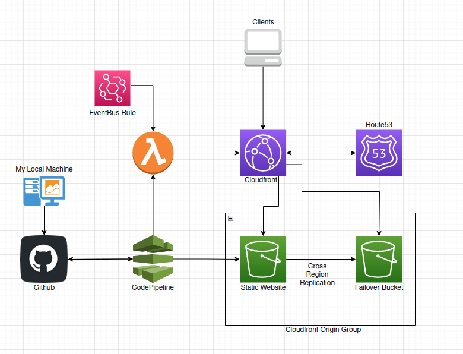

# Cullan's Portfolio Website

## About
Cullancarey.com is a static AWS S3 website fronted by Cloudfront. Please see the architecture diagram below. When I push changes to the Github repository, an AWS CodePipeline is kicked off. This pipeline reads the buildspec.yaml, extracts the necessary files for the website, and pushes them to the corresponding S3 bucket. It also invokes a Lambda function to invalidate the Cloudfront cache, so the updates are available immediately. You can view the lambda code [here](./lambda/invalidate.py). Building cullancarey.com was a fun project for me to do, and I hope you visit the [site](https://www.cullancarey.com)!

### Terraform
Terraform fully manages the website infrastructure, as seen in the [terraform](./terraform) directory. I used the template I created and published to the Terraform registry to deploy cullancarey.com. You can see this public module on the [Terraform Website](https://registry.terraform.io/modules/cullancarey/static-s3-website-template/aws/latest) or its Github [repo](https://github.com/cullancarey/terraform-aws-static-s3-website-template).

### Architecture

### Disclosure
I did not write the HTML for this website. I am not a website developer, so I used a template from [HTML5 UP](http://html5up.net) and filled in the necessary details. 
